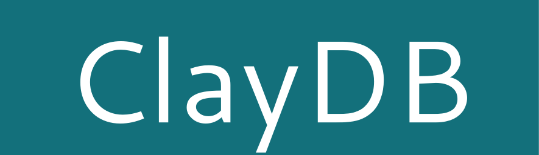
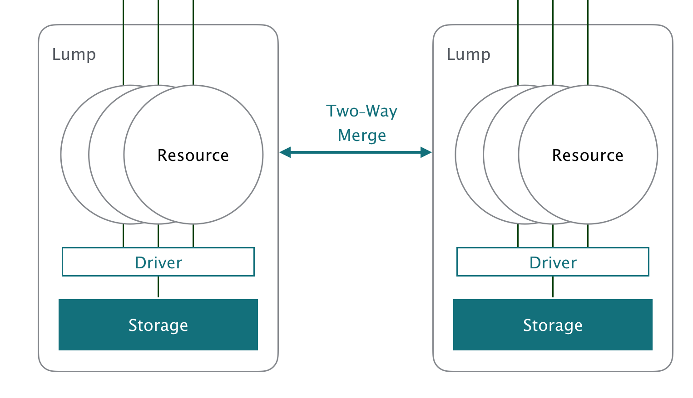

 


<!---
This file is generated by ape-tmpl. Do not update manually.
--->

<!-- Badge Start -->
<a name="badges"></a>

[![Build Status][bd_travis_shield_url]][bd_travis_url]
[![npm Version][bd_npm_shield_url]][bd_npm_url]
[![JS Standard][bd_standard_shield_url]][bd_standard_url]

[bd_repo_url]: https://github.com/realglobe-Inc/claydb
[bd_travis_url]: http://travis-ci.org/realglobe-Inc/claydb
[bd_travis_shield_url]: http://img.shields.io/travis/realglobe-Inc/claydb.svg?style=flat
[bd_travis_com_url]: http://travis-ci.com/realglobe-Inc/claydb
[bd_travis_com_shield_url]: https://api.travis-ci.com/realglobe-Inc/claydb.svg?token=
[bd_license_url]: https://github.com/realglobe-Inc/claydb/blob/master/LICENSE
[bd_codeclimate_url]: http://codeclimate.com/github/realglobe-Inc/claydb
[bd_codeclimate_shield_url]: http://img.shields.io/codeclimate/github/realglobe-Inc/claydb.svg?style=flat
[bd_codeclimate_coverage_shield_url]: http://img.shields.io/codeclimate/coverage/github/realglobe-Inc/claydb.svg?style=flat
[bd_gemnasium_url]: https://gemnasium.com/realglobe-Inc/claydb
[bd_gemnasium_shield_url]: https://gemnasium.com/realglobe-Inc/claydb.svg
[bd_npm_url]: http://www.npmjs.org/package/claydb
[bd_npm_shield_url]: http://img.shields.io/npm/v/claydb.svg?style=flat
[bd_standard_url]: http://standardjs.com/
[bd_standard_shield_url]: https://img.shields.io/badge/code%20style-standard-brightgreen.svg

<!-- Badge End -->


<!-- Description Start -->
<a name="description"></a>

A distributed NoSQL to handle data as web resource

<!-- Description End -->


<!-- Overview Start -->
<a name="overview"></a>

ClayDB written in pure javascript and use pluggable storage to store data. 
Storage can be RDMS like MySQL, files like JSON, LocalStorage in browser, or anything which can store data.

ClayDB is a collection of distributed node called **Lump**, which wraps storage with driver and provide resources to outside.
Each **Lump**s can be merged one another.



<!-- Overview End -->


<!-- Sections Start -->
<a name="sections"></a>

<!-- Section from "doc/guides/00.TOC.md.hbs" Start -->

<a name="section-doc-guides-00-t-o-c-md"></a>

Table of Contents
----------------

- [Requirements](#requirements)
- [Getting Started](#getting-started)
- [API Guides](#api-guides)
- [License](#license)
- [Links](#links)


<!-- Section from "doc/guides/00.TOC.md.hbs" End -->

<!-- Section from "doc/guides/10.Requirements.md.hbs" Start -->

<a name="section-doc-guides-10-requirements-md"></a>

Requirements
-----

<a href="https://nodejs.org">
  </a>
<a href="https://docs.npmjs.com/">
  </a>

+ [Node.js ( >=6 )][node_download_url]
+ [npm ( >=4 )][npm_url]

[node_download_url]: https://nodejs.org/en/download/
[npm_url]: https://docs.npmjs.com/


<!-- Section from "doc/guides/10.Requirements.md.hbs" End -->

<!-- Section from "doc/guides/20.Getting Started.md.hbs" Start -->

<a name="section-doc-guides-20-getting-started-md"></a>

Getting Started
---------

Three step to be getting started.

1. Choose driver and instantiate to connect storage
2. Create lump with the driver
3. Access resource in lump

Resources are collection of data like database table or document collection.
It provides basic CRUD interface to handle data.

```javascript
'use strict'

const clayLump = require('clay-lump')
const { SqliteDriver } = require('clay-driver-sqlite')

async function tryExample () {
  let lump01 = clayLump('lump01', {
    driver: new SqliteDriver('tmp/lump-01.db')
  })

  // Access to resource.
  {
    const Dog = lump01.resource('Dog')

    // Add an entity to resource
    let john = await Dog.create({ name: 'John', type: 'Saint Bernard', age: 3 })
    console.log('New dog created:', john) // -> { id: '1a6358694adb4aa89c15f94be50d5b78', name: 'john', type: 'Saint Bernard', age: 3 }

    // List entities from resource
    let dogs = await Dog.list({
      filter: { type: 'Saint Bernard' },
      page: { size: 25, number: 1 }
    })
    console.log('Found dogs:', dogs) // -> { entities: [ /* ... */ ], meta: { /* ... */ } }

    // Get entity with id
    let johnAgain = await Dog.one(john.id)
    console.log('From id', johnAgain)

    // Update date
    await Dog.update(john.id, { name: 'Shinny John' })

    // Destroy data
    await Dog.destroy(john.id)
  }
}

tryExample().catch((err) => console.error(err))

```

<!-- Section from "doc/guides/20.Getting Started.md.hbs" End -->

<!-- Section from "doc/guides/23.API.md.hbs" Start -->

<a name="section-doc-guides-23-a-p-i-md"></a>

API Guides
---------

+ [Clay-Resource](./doc/api/resource.md)


<!-- Section from "doc/guides/23.API.md.hbs" End -->


<!-- Sections Start -->


<!-- LICENSE Start -->
<a name="license"></a>

License
-------
This software is released under the [Apache-2.0 License](https://github.com/realglobe-Inc/claydb/blob/master/LICENSE).

<!-- LICENSE End -->


<!-- Links Start -->
<a name="links"></a>

Links
------

+ [ClayDB][clay_d_b_url]
+ [ClayLump][clay_lump_url]

[clay_d_b_url]: https://github.com/realglobe-Inc/claydb
[clay_lump_url]: https://github.com/realglobe-Inc/clay-lump

<!-- Links End -->
